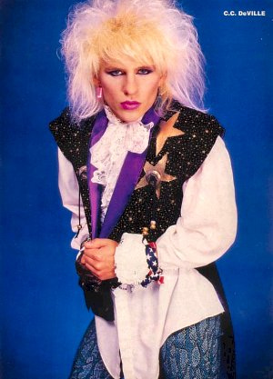

# cc-deville API

a Cache Clearing service named after the lead guitarist of [Poison](https://en.wikipedia.org/wiki/Poison_%28American_band%29).

I never want my cache to [Talk Dirty To Me](https://www.quora.com/What-does-dirty-mean-in-the-context-of-caching), [I Want Action](), immediate action from my caches and backends, and my caches should say "[I Won't Forget You]()" except when they should.

cc-deville is a REST API which allows for cache management, mostly cache clearing and cache status.

Give it a URL and it will figure out which cache service to clear.

Currently supports:

 * cloudflare
 * varnish3
 * varnish4

## all requests

all requests should include the following authorization header:

`X-cc-deville-token: GAt3MosxrfoYSAR2sOuG0NoC4VUqUsIT`


## DELETE /purge?url=$url
## DELETE /purge?url=$url1&url=$url2

### responses:

success...

```
HTTP 202 Accepted
```

failure...
```
HTTP 404 Not Found
```


## GET /status?url=<$url>

all requests
```
HTTP 200 OK

{
   type: "status"
   data: {	   
      caches: [
      	 {
		name: "cloudflare",
		hit:  "true",
		age:  3600,
		http_response: 304
	 },
       	 {
		name: "varnish-live",
		hit:  "false",
		age:  0,
		http_response: 200
	 }
      ]
   }

}

```


